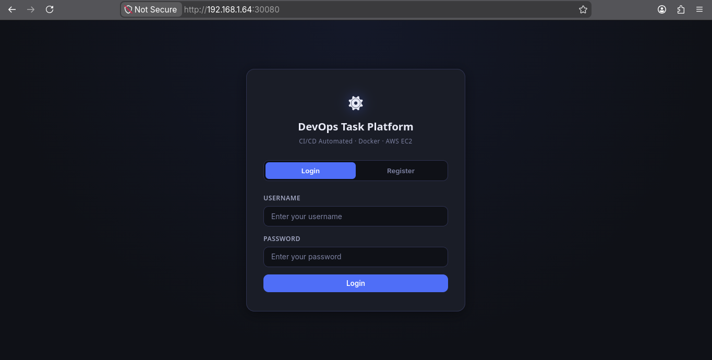
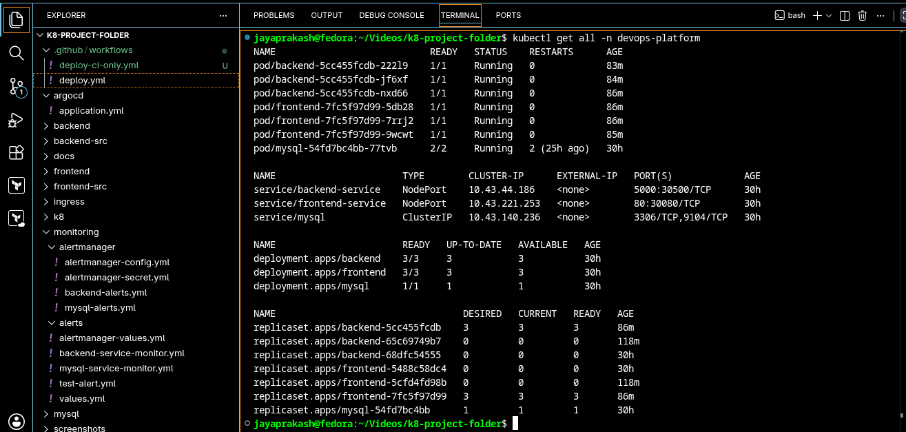
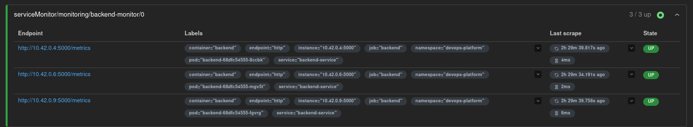
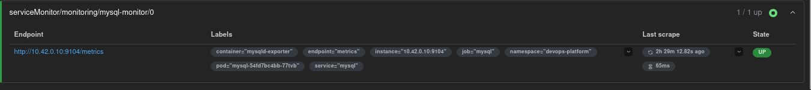
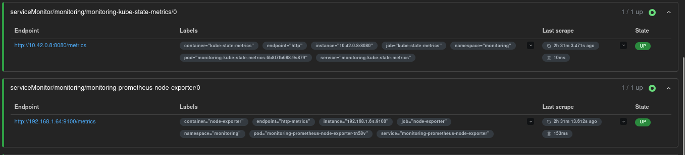
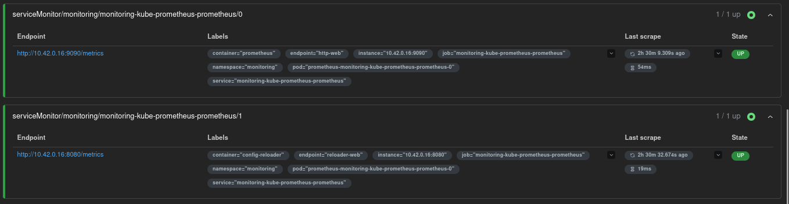
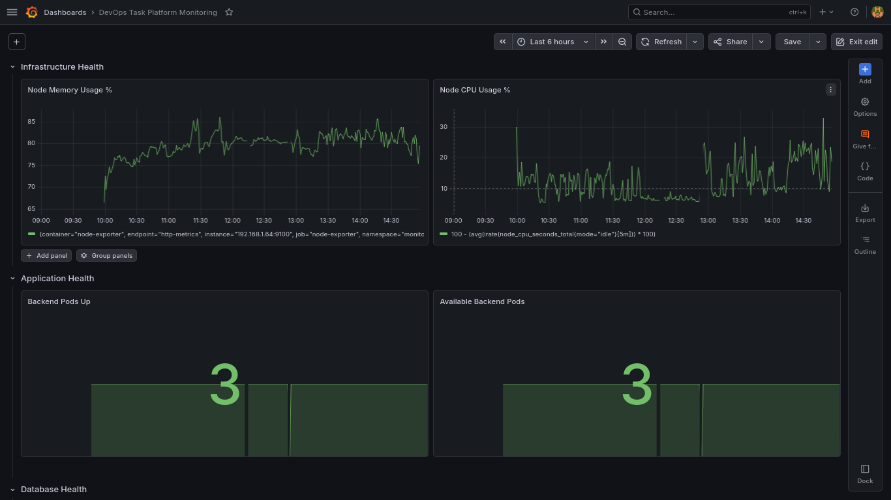
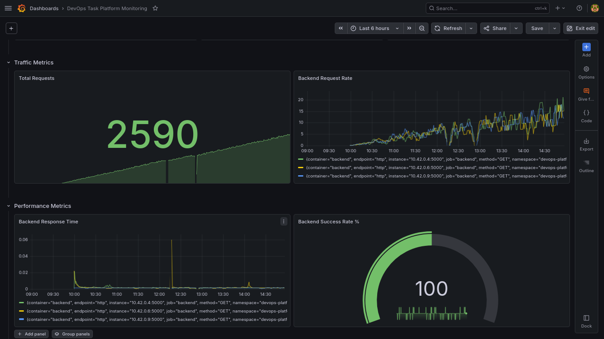
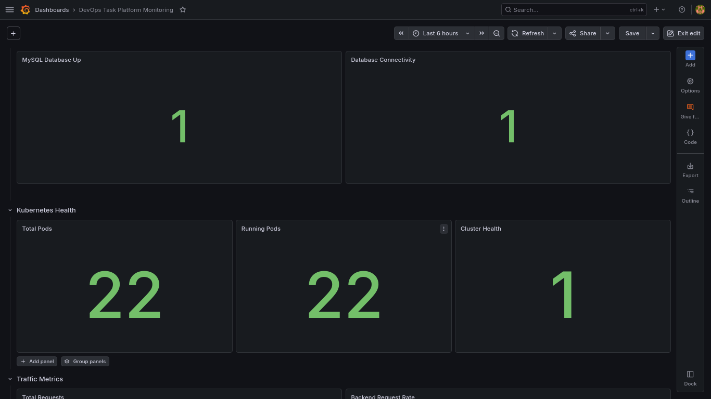
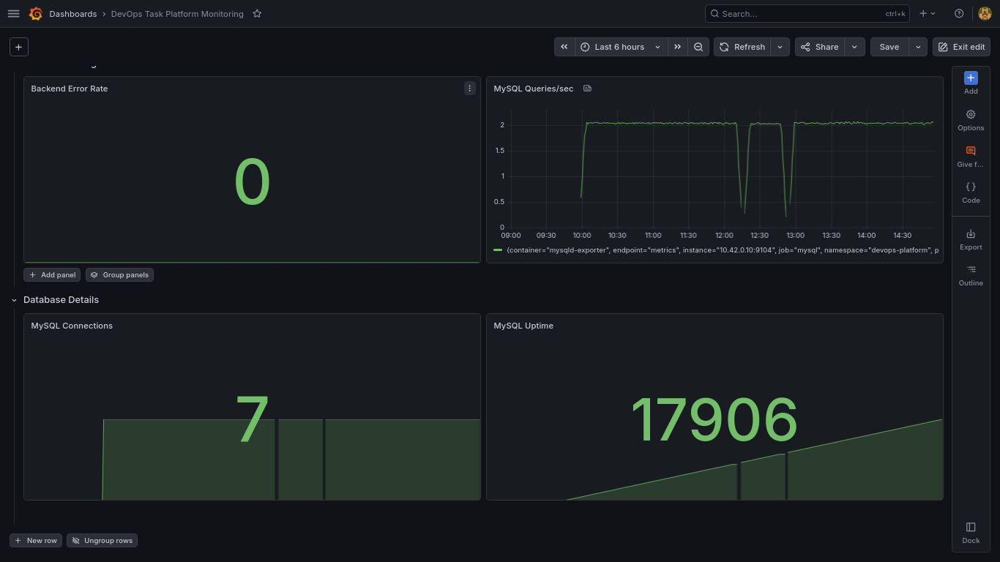

<div align="center">


<br>

*A production-style DevOps project demonstrating GitOps-based Kubernetes deployment using ArgoCD,*
*automated CI/CD with GitHub Actions, containerization with Docker,*
*and full-stack monitoring with Prometheus and Grafana.*

<br>


</div>

---

## 📋 Table of Contents

- [Project Overview](#-project-overview)
- [Architecture](#-architecture)
- [Technology Stack](#-technology-stack)
- [GitOps Workflow](#-gitops-workflow)
- [CI/CD Features](#-cicd-features)
- [Kubernetes Resources](#-kubernetes-resources)
- [Monitoring and Observability](#-monitoring-and-observability)
- [Project Structure](#-project-structure)
- [Getting Started](#-getting-started)
- [Screenshots](#-screenshots)
- [Key Achievements](#-key-achievements)
- [Author](#-author)

---

## 🔍 Project Overview

The **DevOps Task Platform** is a multi-tier web application deployed on Kubernetes using K3s, designed to reflect real-world DevOps practices end-to-end.

<table>
<tr>
<td>

**What this project demonstrates:**

- ✅ Docker containerization
- ✅ Kubernetes orchestration
- ✅ GitHub Actions CI pipeline
- ✅ GitOps deployment with ArgoCD
- ✅ Prometheus monitoring

</td>
<td>

**And also:**

- ✅ Grafana dashboards
- ✅ MySQL database integration
- ✅ Automated image version management
- ✅ Self-healing Kubernetes deployments
- ✅ Full observability stack

</td>
</tr>
</table>

---

## 🏗️ Architecture

```
┌─────────────────────────────────────────────────────────────┐
│                        Developer                             │
└─────────────────────────────┬───────────────────────────────┘
                              │  git push
                              ▼
┌─────────────────────────────────────────────────────────────┐
│                    GitHub Repository                          │
└─────────────────────────────┬───────────────────────────────┘
                              │  triggers
                              ▼
┌─────────────────────────────────────────────────────────────┐
│               GitHub Actions CI Pipeline                      │
│         Build Images ──▶ Push to Docker Hub                  │
│         Update K8s Manifests ──▶ Commit to Git               │
└─────────────────────────────┬───────────────────────────────┘
                              │  manifest change detected
                              ▼
┌─────────────────────────────────────────────────────────────┐
│                    ArgoCD (GitOps)                            │
│       Auto-sync ──▶ Self-heal ──▶ Deploy to Cluster          │
└─────────────────────────────┬───────────────────────────────┘
                              │
                              ▼
┌─────────────────────────────────────────────────────────────┐
│                  K3s Kubernetes Cluster                       │
│                                                              │
│   ┌─────────────┐    ┌─────────────┐    ┌───────────────┐   │
│   │  Frontend   │    │   Backend   │───▶│     MySQL     │   │
│   │ (3 replicas)│    │ (3 replicas)│    │  (1 replica)  │   │
│   └─────────────┘    └─────────────┘    └───────────────┘   │
│                                                              │
│   ┌──────────────────────────────────────────────────────┐  │
│   │               Monitoring Stack                        │  │
│   │   Prometheus ──▶ Grafana    Node Exporter            │  │
│   │   MySQL Exporter            ServiceMonitors           │  │
│   └──────────────────────────────────────────────────────┘  │
└─────────────────────────────────────────────────────────────┘
```

---

## 🛠️ Technology Stack

### ☁️ Cloud and Infrastructure

| Tool | Purpose |
|---|---|
| **AWS EC2** | Host machine for the K3s cluster |
| **K3s Kubernetes** | Lightweight Kubernetes distribution |
| **Docker** | Container runtime and image builds |
| **Docker Hub** | Container image registry |

### 🔁 CI/CD and GitOps

| Tool | Purpose |
|---|---|
| **GitHub Actions** | Automated CI pipeline |
| **ArgoCD** | GitOps continuous delivery |
| **Git / GitHub** | Source control and manifest repository |

### 📊 Monitoring

| Tool | Purpose |
|---|---|
| **Prometheus** | Metrics collection and alerting |
| **Grafana** | Visualization and dashboards |
| **Node Exporter** | Host-level metrics |
| **MySQL Exporter** | Database metrics |
| **ServiceMonitors** | Automatic Prometheus target discovery |

### 🖥️ Application

| Layer | Technology |
|---|---|
| **Frontend** | HTML, CSS, JavaScript |
| **Backend** | Python, Flask |
| **Database** | MySQL |

---

## 🔄 GitOps Workflow

```
Step 1 ── Developer pushes code to GitHub
             │
             ▼
Step 2 ── GitHub Actions builds backend and frontend Docker images
             │
             ▼
Step 3 ── Images are pushed to Docker Hub
             │
             ▼
Step 4 ── GitHub Actions automatically updates Kubernetes image tags
             │
             ▼
Step 5 ── Updated manifests are committed back to GitHub
             │
             ▼
Step 6 ── ArgoCD detects repository changes
             │
             ▼
Step 7 ── ArgoCD automatically synchronizes the Kubernetes cluster
             │
             ▼
Step 8 ── New application version is deployed
             │
             ▼
Step 9 ── Prometheus and Grafana monitor application health
```

---

## ⚙️ CI/CD Features

### GitHub Actions

| Feature | Description |
|---|---|
| Automated image build | Builds frontend and backend images on every push |
| Docker Hub push | Publishes versioned images to Docker Hub |
| Automatic tag generation | Tags images with Git commit SHA |
| Manifest update | Patches K8s image tags automatically |
| GitOps integration | Commits updated manifests back to the repo |

### ArgoCD

| Feature | Description |
|---|---|
| Automatic synchronization | Detects and applies Git changes to the cluster |
| Self-healing | Reverts any manual drift back to Git state |
| Automated deployment | No manual `kubectl apply` needed |
| GitOps state management | Git is the single source of truth |

---

## ☸️ Kubernetes Resources

**Application Namespace:** `devops-platform`

**Deployments**

```
backend      (3 replicas)
frontend     (3 replicas)
mysql        (1 replica)
```

**Services**

```
backend-service     NodePort    5000 → 30500
frontend-service    NodePort    80   → 30080
mysql               ClusterIP   3306, 9104
```

**Monitoring Components**

```
Prometheus       Grafana          Alertmanager
Node Exporter    MySQL Exporter   ServiceMonitors
```

---

## 📊 Monitoring and Observability

All targets are discovered automatically using **Prometheus ServiceMonitors** — no static config needed.

### Scrape Targets

| Target | Exporter | Port |
|---|---|---|
| Backend pods | Built-in `/metrics` | 5000 |
| MySQL | MySQL Exporter | 9104 |
| Node | Node Exporter | 9100 |
| Kubernetes | kube-state-metrics | 8080 |

### Grafana Dashboards

**🖥️ Infrastructure Health**
- Node CPU Usage %
- Node Memory Usage %
- Backend Pod Availability

**📈 Application Metrics**
- Total Requests
- Backend Request Rate
- Response Time
- Success Rate

**🏥 Cluster and Database Health**
- Running Pods
- Cluster Health
- Database Status
- Database Connectivity

**🗄️ Database Performance**
- MySQL Queries/sec
- MySQL Connections
- MySQL Uptime
- Database Error Rate

### Access URLs

| Service | URL |
|---|---|
| Grafana | `http://<NODE-IP>:30080` |
| Prometheus | `http://<NODE-IP>:30090` |
| ArgoCD | `http://<NODE-IP>:8080` |

---

## 📁 Project Structure

```
kubernetes-devops-task-platform/
│
├── .github/
│   └── workflows/
│       └── deploy.yml                    # GitHub Actions CI pipeline
│
├── argocd/
│   └── application.yml                   # ArgoCD Application manifest
│
├── backend/                              # Backend Kubernetes manifests
├── backend-src/                          # Python Flask source code
│
├── frontend/                             # Frontend Kubernetes manifests
├── frontend-src/                         # HTML / CSS / JS source
│
├── k8/                                   # Core Kubernetes manifests
├── mysql/                                # MySQL deployment manifests
│
├── monitoring/
│   ├── alertmanager/
│   ├── alerts/
│   ├── backend-service-monitor.yml
│   └── mysql-service-monitor.yml
│
└── screenshots/
    ├── application-login-page.png
    ├── application-dashboard.png
    ├── argocd-gitops-sync.png
    ├── kubernetes-resources.png
    ├── prometheus-backend-targets.png
    ├── prometheus-mysql-target.png
    ├── prometheus-cluster-monitoring.png
    ├── prometheus-core-services.png
    ├── grafana-infrastructure-health.png
    ├── grafana-application-metrics.png
    ├── grafana-cluster-database-health.png
    └── grafana-database-performance.png
```

---

## 🚀 Getting Started

### Prerequisites

- K3s cluster running on AWS EC2
- `kubectl` configured against your cluster
- ArgoCD installed in the cluster
- Docker Hub account with push access
- GitHub repository with Actions enabled

### 1 — Clone the Repository

```bash
git clone https://github.com/jaya-prakash-s-devops/kubernetes-devops-task-platform.git
cd kubernetes-devops-task-platform
```

### 2 — Deploy the Application

```bash
kubectl apply -f .
```

### 3 — Deploy ArgoCD Application

```bash
kubectl apply -f argocd/application.yml
```

### 4 — Verify Resources

```bash
kubectl get all -n devops-platform
```

---

## 📸 Screenshots

### 🔐 Application — Login Page

> User authentication page with registration and login support.



---

### 📋 Application — Task Dashboard

> Task management dashboard with full CRUD operations and status tracking.


---

### 🔄 ArgoCD — GitOps Sync Status

> ArgoCD automatically synchronizing Kubernetes resources from Git.
> **App Health:** Healthy &nbsp;|&nbsp; **Sync Status:** Synced &nbsp;|&nbsp; **Auto-sync:** Enabled


---

### ☸️ Kubernetes — Running Resources

> All deployments, services, and replicasets running inside the cluster.



---

### 📡 Prometheus — Backend Targets

> Prometheus scraping all 3 backend pod replicas via ServiceMonitor — all **UP**.



---

### 🗄️ Prometheus — MySQL Target

> MySQL Exporter endpoint actively scraped and reporting — **UP**.



---

### 🔭 Prometheus — Cluster Monitoring

> Internal cluster services being monitored by Prometheus.



---

### 🧩 Prometheus — Core Services

> Node Exporter and kube-state-metrics both active and **UP**.



---

### 🖥️ Grafana — Infrastructure Health Dashboard

> Node CPU and memory usage tracked in real time with backend pod availability.



---

### 📈 Grafana — Application Metrics Dashboard

> Live request rate, response time, success rate, and total requests.



---

### 🏥 Grafana — Cluster and Database Health Dashboard

> Running pod count, cluster health status, and database connectivity visualized.



---

### 🗄️ Grafana — Database Performance Dashboard

> MySQL queries per second, active connections, uptime, and error rate.



---

## 🏆 Key Achievements

| # | Achievement |
|---|---|
| 1 | Implemented GitOps deployment with ArgoCD — zero manual `kubectl apply` |
| 2 | Automated full CI pipeline using GitHub Actions |
| 3 | Automated Kubernetes image updates on every code push |
| 4 | Built and deployed a multi-tier application on Kubernetes |
| 5 | Implemented Prometheus monitoring with ServiceMonitor-based discovery |
| 6 | Built four custom Grafana dashboards across infra, app, cluster, and DB layers |
| 7 | Configured MySQL monitoring with dedicated exporter |
| 8 | Achieved full Kubernetes observability across all namespaces |
| 9 | Implemented self-healing deployments via ArgoCD reconciliation |
| 10 | Managed rolling application updates with zero downtime |

---

## 👤 Author

<div align="center">

**Jaya Prakash S** — Junior DevOps Engineer

[](https://github.com/jaya-prakash-s-devops)
[](https://www.linkedin.com/in/jaya-prakash-s-devops)

</div>
