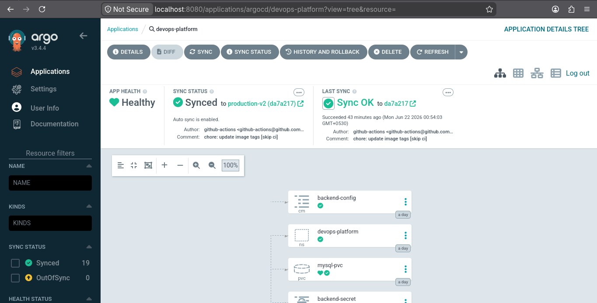

# ⚙️ DevOps Task Platform

<div align="center">


**A full-stack task management application deployed on a K3s Kubernetes cluster using GitOps principles — demonstrating containerization, orchestration, automated CI/CD, and production-grade observability.**

</div>

---

## 📋 Table of Contents

- [Overview](#-overview)
- [Architecture](#-architecture)
- [Technology Stack](#-technology-stack)
- [Application Features](#-application-features)
- [GitOps Workflow](#-gitops-workflow)
- [Kubernetes Infrastructure](#-kubernetes-infrastructure)
- [CI Pipeline](#-ci-pipeline)
- [Monitoring & Observability](#-monitoring--observability)
- [Project Structure](#-project-structure)
- [Getting Started](#-getting-started)
- [Screenshots](#-screenshots)

---

## 🔍 Overview

The **DevOps Task Platform** is a portfolio project built to demonstrate core DevOps engineering practices in a realistic, end-to-end environment. It features a simple full-stack task management application — but the real focus is the infrastructure around it:

- **Containerization** with Docker for consistent, reproducible builds
- **Kubernetes orchestration** on a self-managed K3s cluster with namespace isolation, health probes, and replica-based deployments
- **GitOps deployment** via ArgoCD with automatic sync and self-healing
- **Automated CI pipeline** with GitHub Actions that builds, pushes, and updates image tags on every commit
- **Full observability stack** using Prometheus, Grafana, Node Exporter, and MySQL Exporter with custom dashboards

This project reflects the kind of infrastructure a small engineering team would run in a real-world production environment.

---

## 🏗️ Architecture

```
┌─────────────────────────────────────────────────────────────────┐
│                        Developer Workflow                        │
│                                                                  │
│   git push  →  GitHub Actions  →  Docker Hub  →  Manifest Update│
└──────────────────────────┬──────────────────────────────────────┘
                           │
                           ▼
┌─────────────────────────────────────────────────────────────────┐
│                    GitOps (ArgoCD)                               │
│         Watches Git repo → Syncs to K3s cluster                  │
└──────────────────────────┬──────────────────────────────────────┘
                           │
                           ▼
┌─────────────────────────────────────────────────────────────────┐
│                   K3s Kubernetes Cluster                          │
│                                                                  │
│  Namespace: devops-platform          Namespace: monitoring       │
│  ┌──────────────────────────┐       ┌───────────────────────┐   │
│  │  frontend (3 replicas)   │       │  Prometheus            │   │
│  │  backend  (3 replicas)   │       │  Grafana               │   │
│  │  mysql    (1 replica)    │       │  Alertmanager          │   │
│  │  ConfigMaps / Secrets    │       │  Node Exporter         │   │
│  │  PVC for MySQL           │       │  MySQL Exporter        │   │
│  └──────────────────────────┘       │  ServiceMonitors       │   │
│                                     └───────────────────────┘   │
└─────────────────────────────────────────────────────────────────┘
```

---

## 🛠️ Technology Stack

| Layer | Technology |
|---|---|
| **Frontend** | HTML, CSS, JavaScript |
| **Backend** | Python (Flask) |
| **Database** | MySQL |
| **Containerization** | Docker |
| **Orchestration** | K3s Kubernetes |
| **GitOps** | ArgoCD |
| **CI Pipeline** | GitHub Actions |
| **Monitoring** | Prometheus, Grafana, Node Exporter, MySQL Exporter |
| **Alerting** | Alertmanager |

---

## ✅ Application Features

The application itself is a straightforward task manager with:

- **User Registration** — Create a new account
- **User Login / Logout** — Session-based authentication
- **Task Creation** — Add tasks with a description
- **Task Management** — View and manage all your tasks
- **Status Tracking** — Track tasks as `Pending`, `In Progress`, or `Completed`
- **Filtered Views** — Filter task list by status

---

## 🔄 GitOps Workflow

```
Developer → git push → GitHub Repository
                            │
                            ▼
                    GitHub Actions CI
                    ├── Build frontend Docker image
                    ├── Build backend Docker image
                    ├── Push images to Docker Hub
                    └── Update image tags in K8s manifests
                            │
                            ▼
                    GitHub Repository (updated manifests)
                            │
                            ▼
                        ArgoCD
                    ├── Detects manifest diff
                    ├── Auto-syncs to K3s cluster
                    └── Reconciles desired vs actual state
                            │
                            ▼
                    K3s Cluster (updated deployment)
```

ArgoCD continuously reconciles the cluster state against the Git repository. If any resource drifts from the declared state, ArgoCD automatically corrects it — providing **self-healing** behavior without manual intervention.

---

## ☸️ Kubernetes Infrastructure

### Namespace

All application workloads are isolated in the `devops-platform` namespace. Monitoring components run in a separate `monitoring` namespace.

### Workloads

| Resource | Name | Replicas |
|---|---|---|
| Deployment | `backend` | 3 |
| Deployment | `frontend` | 3 |
| Deployment | `mysql` | 1 |

### Services

| Service | Type | Port |
|---|---|---|
| `frontend-service` | NodePort | 80:30080 |
| `backend-service` | NodePort | 5000:30500 |
| `mysql` | ClusterIP | 3306, 9104 |

### Key Kubernetes Features Used

- **Namespace isolation** — Application and monitoring separated
- **Deployments** — Declarative replica management with rolling updates
- **ConfigMaps** — Externalized application configuration
- **Secrets** — Sensitive values (DB credentials) stored securely
- **Persistent Volume Claim** — MySQL data persisted across pod restarts
- **Readiness Probes** — Traffic only sent to healthy pods
- **Liveness Probes** — Unhealthy pods automatically restarted
- **Rolling Updates** — Zero-downtime deployments via ArgoCD sync

---

## ⚙️ CI Pipeline

The GitHub Actions workflow runs on every push to the main branch:

```yaml
Trigger: push to main
  │
  ├── Step 1: Build frontend Docker image
  ├── Step 2: Build backend Docker image
  ├── Step 3: Push both images to Docker Hub
  └── Step 4: Update image tags in Kubernetes manifests
              └── Commit updated manifests back to repo
                  └── ArgoCD picks up the change automatically
```

The pipeline uses the Git commit SHA as the Docker image tag, ensuring every deployment is fully traceable back to a specific commit.

---

## 📊 Monitoring & Observability

The monitoring stack runs in the `monitoring` namespace and scrapes metrics from all key components using Prometheus ServiceMonitors.

### Metrics Scraping Targets

| Target | Exporter | Metrics |
|---|---|---|
| Backend pods | Prometheus (built-in) | Request rate, response time, error rate, success % |
| MySQL | MySQL Exporter (port 9104) | Queries/sec, connections, uptime |
| K3s Node | Node Exporter (port 9100) | CPU %, memory %, disk I/O |
| Kubernetes | kube-state-metrics | Pod count, deployment health |
| Prometheus itself | Self-scrape | Prometheus internals |

### Grafana Dashboards

Custom dashboards built to monitor all layers of the stack:

**Infrastructure Health**
- Node Memory Usage %
- Node CPU Usage %
- Backend Pods Up / Available

**Application Metrics**
- Total HTTP Requests (2,590+ captured)
- Backend Request Rate (per pod)
- Backend Response Time
- Backend Success Rate % (100%)
- Backend Error Rate (0)

**Cluster & Database Health**
- MySQL Database Up (status: 1)
- Database Connectivity (status: 1)
- Total Pods (22) / Running Pods (22)
- Cluster Health (status: 1)

**Database Performance**
- MySQL Queries/sec
- MySQL Connections (7 active)
- MySQL Uptime (17,906 seconds)

---

## 📁 Project Structure

```
k8-project-folder/
├── .github/
│   └── workflows/
│       ├── deploy.yml              # Full CI/CD pipeline
│       └── deploy-ci-only.yml      # CI-only workflow
├── argocd/
│   └── application.yml             # ArgoCD Application manifest
├── backend/                        # Kubernetes manifests for backend
├── backend-src/                    # Flask application source
├── frontend/                       # Kubernetes manifests for frontend
├── frontend-src/                   # HTML/CSS/JS source
├── ingress/                        # Ingress resource definitions
├── k8/                             # Core Kubernetes manifests
├── mysql/                          # MySQL deployment manifests
├── monitoring/
│   ├── alertmanager/
│   │   ├── alertmanager-config.yml
│   │   └── alertmanager-secret.yml
│   ├── alerts/
│   │   ├── alertmanager-values.yml
│   │   ├── backend-alerts.yml
│   │   ├── mysql-alerts.yml
│   │   └── test-alert.yml
│   ├── backend-service-monitor.yml
│   ├── mysql-service-monitor.yml
│   └── values.yml
└── docs/
```

---

## 🚀 Getting Started

### Prerequisites

- A running K3s cluster
- `kubectl` configured to point at your cluster
- ArgoCD installed in the cluster
- Docker Hub account (for image pushes)
- GitHub repository with Actions enabled

### 1. Clone the Repository

```bash
git clone https://github.com/<your-username>/devops-task-platform.git
cd devops-task-platform
```

### 2. Configure Secrets

Create the required Kubernetes secrets (DB credentials, Docker Hub credentials) before applying manifests:

```bash
kubectl create namespace devops-platform

kubectl create secret generic backend-secret \
  --from-literal=DB_PASSWORD=<your-db-password> \
  -n devops-platform
```

### 3. Register the App in ArgoCD

Apply the ArgoCD Application manifest to register the app for GitOps sync:

```bash
kubectl apply -f argocd/application.yml
```

ArgoCD will detect the manifests in the repo and automatically sync the full application to the cluster.

### 4. Set GitHub Actions Secrets

In your GitHub repository settings, add the following secrets:

| Secret | Description |
|---|---|
| `DOCKER_USERNAME` | Your Docker Hub username |
| `DOCKER_PASSWORD` | Your Docker Hub password or access token |

### 5. Verify Deployment

```bash
kubectl get all -n devops-platform
```

Expected output: 3 backend pods, 3 frontend pods, 1 MySQL pod — all in `Running` state.

---

## 📸 Screenshots

### Application

**Login Page**


**Task Dashboard** — shows task creation, status tracking, and filters


---

### ArgoCD — GitOps Sync

Application health: **Healthy** | Sync status: **Synced** | Auto-sync: **Enabled**



---

### Kubernetes Resources

All pods running with 0 restarts across backend, frontend, and MySQL deployments.


---

### Prometheus — Monitoring Targets

**Backend Service Monitor** — All 3 backend pod endpoints scraped and UP


**MySQL Exporter Target** — MySQL metrics endpoint scraped and UP


**Cluster Monitoring** — kube-state-metrics and Node Exporter both UP


**Core Services** — Prometheus self-monitoring endpoints UP


---

### Grafana Dashboards

**Infrastructure Health** — Node memory ~80%, CPU usage, 3 backend pods running


**Application Metrics** — 2,590 total requests, 100% success rate, 0 errors


**Cluster & Database Health** — 22/22 pods running, MySQL up, cluster healthy


**Database Performance** — MySQL queries/sec, 7 connections, 17,906s uptime


---

## 🎯 Key Takeaways

This project demonstrates the ability to:

- Containerize a multi-service application with Docker
- Deploy and manage workloads on a self-managed Kubernetes cluster (K3s)
- Implement GitOps with ArgoCD for declarative, automated deployment
- Build a CI pipeline with GitHub Actions that produces tagged, traceable Docker images
- Configure a full observability stack (Prometheus + Grafana + exporters) with custom dashboards
- Apply Kubernetes best practices: health probes, secrets management, PVCs, namespace isolation, and rolling updates

---

<div align="center">

Made by **Jayaprakash** · Junior DevOps Engineer

</div>
