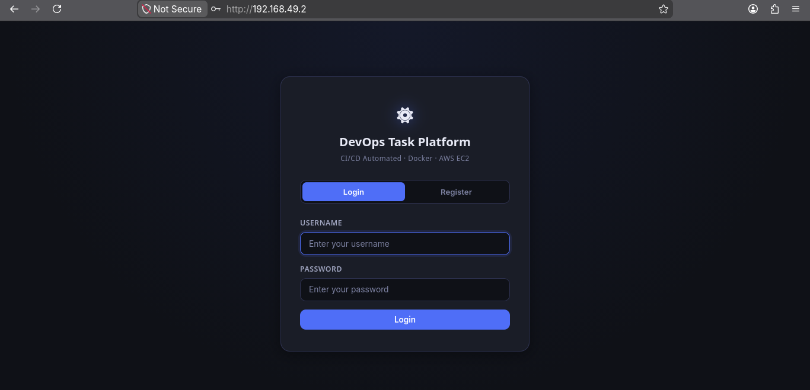
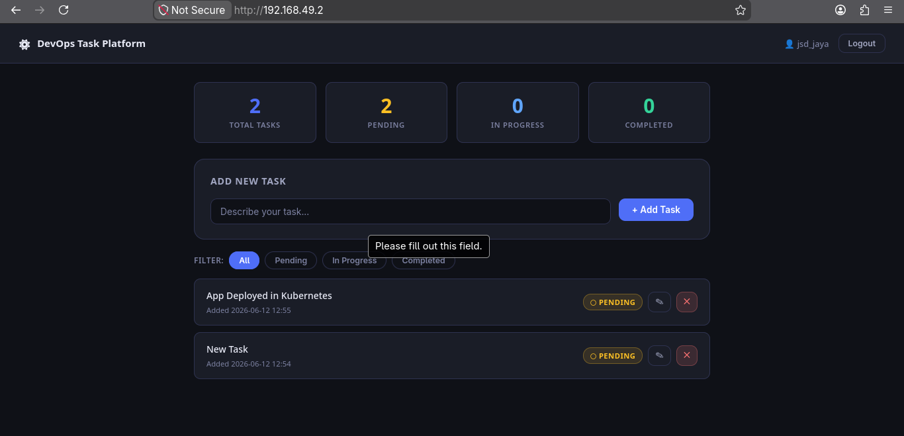
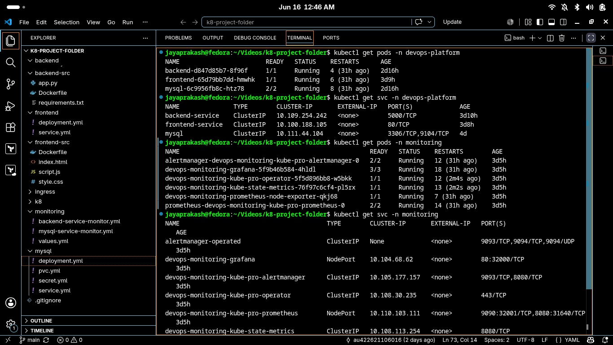
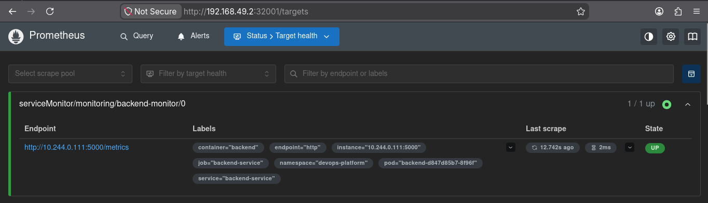
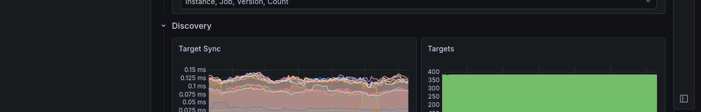
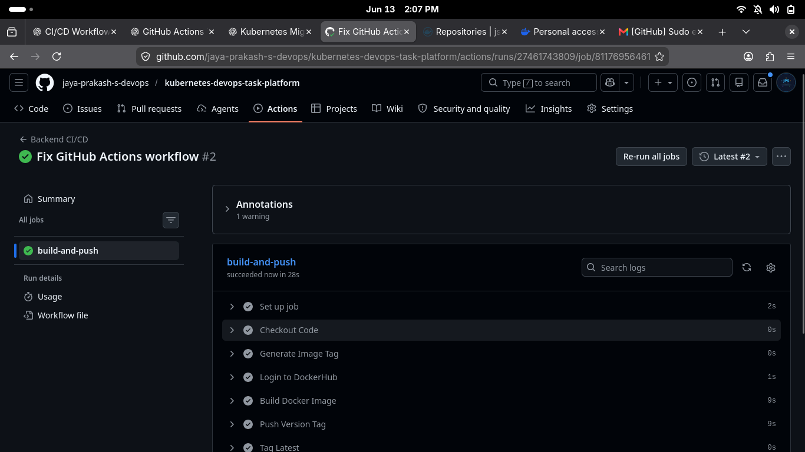
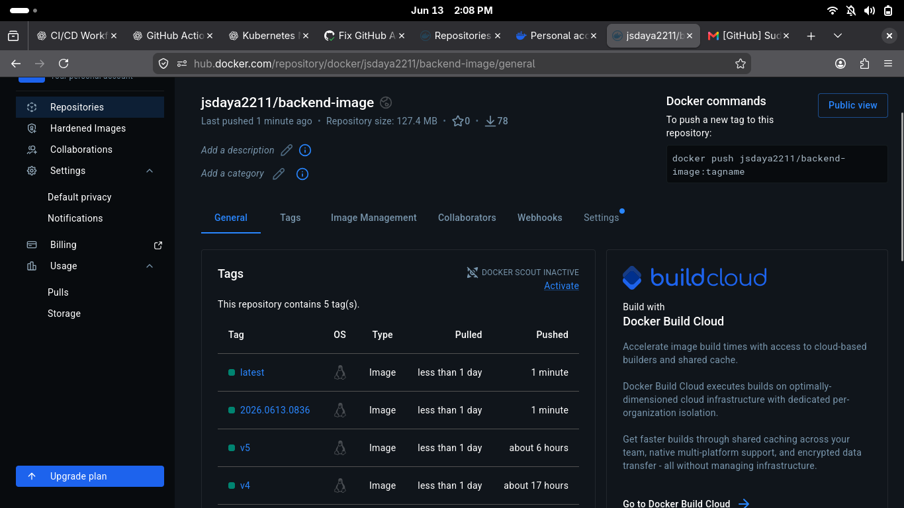

# 🚀 Kubernetes DevOps Task Platform

A production-style Kubernetes deployment project demonstrating containerization, CI automation, Kubernetes orchestration, ingress networking, monitoring, and observability.

This project deploys a full-stack Task Management Application consisting of a Frontend, Backend API, and MySQL Database on Kubernetes. The application is containerized using Docker, automatically built and pushed to Docker Hub using GitHub Actions, and monitored using Prometheus and Grafana.

---

# 📌 Features

* Dockerized Frontend and Backend
* MySQL Database with Persistent Storage
* Kubernetes Deployments and Services
* Namespace Isolation
* ConfigMaps and Secrets
* NGINX Ingress Controller
* GitHub Actions CI Pipeline
* Docker Hub Image Publishing
* Prometheus Monitoring
* Grafana Dashboard Visualization
* ServiceMonitor Integration
* MySQL Exporter Metrics
* Backend Application Metrics

---

# 🏗️ Architecture

```text
                     User
                       │
                       ▼
                NGINX Ingress
                       │
          ┌────────────┴────────────┐
          ▼                         ▼
    Frontend Service         Backend Service
                                      │
                                      ▼
                              MySQL Database
```

Monitoring Stack

```text
Backend Metrics ──┐
                  │
MySQL Metrics ────┼──► Prometheus ───► Grafana
                  │
Cluster Metrics ──┘
```

---

# 🛠️ Technology Stack

## Containerization

* Docker

## CI

* GitHub Actions

## Container Registry

* Docker Hub

## Kubernetes

* Minikube
* Deployments
* Services
* Ingress
* ConfigMaps
* Secrets
* Persistent Volume Claims

## Monitoring

* Prometheus
* Grafana
* Prometheus Operator
* ServiceMonitor
* Node Exporter
* Kube State Metrics

## Application

* Python Flask
* HTML
* CSS
* JavaScript
* MySQL

---

# 📂 Project Structure

```text
.
├── backend
│   ├── configmap.yml
│   ├── deployment.yml
│   ├── secret.yml
│   └── service.yml
│
├── backend-src
│   ├── app.py
│   ├── Dockerfile
│   └── requirements.txt
│
├── frontend
│   ├── deployment.yml
│   └── service.yml
│
├── frontend-src
│   ├── Dockerfile
│   ├── index.html
│   ├── script.js
│   └── style.css
│
├── ingress
│   └── ingress.yml
│
├── k8
│   └── namespace.yml
│
├── monitoring
│   ├── backend-service-monitor.yml
│   ├── mysql-service-monitor.yml
│   └── values.yml
│
├── mysql
│   ├── deployment.yml
│   ├── pvc.yml
│   ├── secret.yml
│   └── service.yml
│
├── screenshots
│
└── .github/workflows
    └── deploy.yml
```

---

# ⚙️ CI Pipeline

The GitHub Actions workflow automates Docker image creation and publishing.

### Workflow Steps

1. Checkout Source Code
2. Generate Image Version Tag
3. Login to Docker Hub
4. Build Docker Image
5. Push Version Tag
6. Tag Latest Image
7. Push Latest Tag
8. Verify Image Availability

Whenever code changes are pushed to GitHub, a new Docker image is automatically built and published to Docker Hub.

---

# ☸️ Kubernetes Resources

### Namespace

* devops-platform

### Backend

* Deployment
* Service
* ConfigMap
* Secret

### Frontend

* Deployment
* Service

### Database

* MySQL Deployment
* Service
* Secret
* PVC

### Networking

* NGINX Ingress Controller
* Ingress Resource

### Monitoring

* Prometheus
* Grafana
* ServiceMonitor
* Node Exporter
* Kube State Metrics

---

# 📊 Monitoring & Observability

Prometheus is configured to scrape:

### Backend Metrics

* Application Metrics Endpoint
* ServiceMonitor Integration

### MySQL Metrics

* MySQL Exporter Metrics
* Database Monitoring

### Cluster Metrics

* Node Exporter
* Kubernetes State Metrics

Grafana is connected to Prometheus and provides dashboard visualization for cluster and application monitoring.

---

# ✅ Deployment Verification

Successfully Running Components:

* Frontend Pod
* Backend Pod
* MySQL Pod
* Prometheus
* Grafana
* Node Exporter
* Kube State Metrics

Prometheus Monitoring Targets:

* Backend Service Monitor
* MySQL Service Monitor

All monitoring targets are successfully scraped by Prometheus.

---

# 📸 Screenshots

## Login Page



---

## Application Dashboard



---

## Kubernetes Deployment



---

## Prometheus Targets



---

## Grafana Dashboard



---

## GitHub Actions Pipeline



---

## Docker Hub Repository



---

# 🎯 Learning Outcomes

Through this project, I gained hands-on experience with:

* Docker Containerization
* GitHub Actions Automation
* Docker Hub Registry Management
* Kubernetes Deployments and Services
* Ingress Configuration
* ConfigMaps and Secrets
* Persistent Storage Management
* Prometheus Monitoring
* Grafana Visualization
* ServiceMonitor Configuration
* Kubernetes Troubleshooting
* DevOps Best Practices

---

# 🚀 Future Improvements

* Helm Charts
* ArgoCD GitOps Deployment
* Horizontal Pod Autoscaling
* TLS with Cert Manager
* AlertManager Integration
* Centralized Logging (ELK Stack)
* Multi-Environment Deployment Strategy

---

# 👨‍💻 Author

**Jaya Prakash S**

GitHub: https://github.com/jaya-prakash-s-devops

LinkedIn: Add your LinkedIn profile link here
